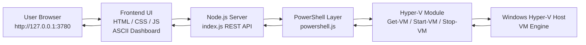

# hyperv-ascii-orchestrator

> Local web-based management dashboard for Hyper-V on Windows 11. Runs entirely on localhost with no cloud dependencies.

---


## Requirements

- **Windows 11** (or Windows 10 with Hyper-V)
- **Node.js** 16+ ([nodejs.org](https://nodejs.org))
- **Hyper-V** enabled (Windows Features → Hyper-V)
- **PowerShell** with Hyper-V module (included with Hyper-V role)

## Quick Start

1. Open PowerShell in this folder.
2. Run **`.\start.ps1`** — it will prompt for **Administrator (UAC)** once (recommended).  
   To skip UAC: `.\start.ps1 -NoElevate`
3. Open **http://127.0.0.1:3780**

If you see **authorization policy** / permission errors on computer:

- Run the dashboard **elevated**, **or**
- Add your Windows user to **Hyper-V Administrators** (Computer Management → Groups), sign out/in, **or**
- In the UI → **Credentials**: enter an account that has Hyper-V rights (e.g. `.\Administrator` + password).  
  Leave **Computer** empty for this PC; or enter another host name for remote Hyper-V (WinRM to that host must work).

```powershell
node server/index.js
```
(Use elevated PowerShell or Credentials as above.)

## Port

Default port is **3780**. Override with (if needed):

```powershell
$env:PORT=8080; node server/index.js
```

## Features

- **Hosts** – Local Hyper-V host in sidebar
- **VM list** – Name, State, CPU %, RAM, Uptime (refreshes every 3 seconds)
- **Actions** – Start, Stop, Restart, Pause, Resume, Checkpoint, Snapshots, Delete (with confirmation)
- **New VM** – Create VM with name, RAM (MB), CPU count, disk size (GB)
- **Checkpoints** – Create snapshot, list and remove checkpoints
- **Dark terminal-style UI** – ASCII box drawing, monospace, status colors (green/red/yellow)

## Project Structure

```
hyperv-ascii-orchestrator/
  server/
    index.js      # HTTP server + REST API
    powershell.js # Hyper-V PowerShell integration
  public/
    index.html
    styles.css
    app.js
  start.ps1
  package.json
  README.md
```

## How it works



## API (localhost only)

- `GET /api/hosts` – List hosts
- `GET /api/vms` – List VMs
- `POST /api/vms/:name/start|stop|restart|pause|resume`
- `GET /api/vms/:name/checkpoints` – List checkpoints
- `POST /api/vms/:name/checkpoint` – Create checkpoint
- `DELETE /api/vms/:name/checkpoints/:snapshot` – Remove checkpoint
- `POST /api/vms` – Create VM (body: `name`, `memoryMB`, `processorCount`, `diskSizeGB`)
- `PUT /api/vms/:name` – Update VM (body: `memoryMB`, `processorCount`)
- `DELETE /api/vms/:name` – Delete VM

## Notes

- At least one **Virtual Switch** must exist in Hyper-V for creating new VMs (create one in Hyper-V Manager if needed).
- The server binds to `127.0.0.1` only; not exposed on the network.
