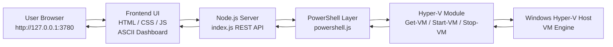

# hyperv-ascii-orchestrator

> Local web-based management dashboard for Hyper-V on Windows 11. Runs entirely on localhost with no cloud dependencies.

---


---

## Requirements

| Item | Notes |
|------|--------|
| **OS** | Windows with Hyper-V (Pro/Enterprise/Education, or Server) |
| **Node.js** | **v16+** (for dev / building; the packaged `.exe` bundles its own runtime) |
| **Hyper-V** | Role/feature enabled; many operations need elevation |
| **PowerShell** | Used for all VM/host operations |

For **remote** Hyper-V hosts, configure credentials in the app (see below). The dashboard still runs locally; it invokes PowerShell against the target computer.

---

## How it works



## Quick start (web)

```bash
npm install
npm start
```

Open **http://127.0.0.1:3780/** in your browser.

- Default port: **3780**. Override with `PORT`:

  ```bash
  set PORT=4000
  npm start
  ```

---

## Quick start (Electron desktop)

**Option A — server already running**

```bash
npm start
```

In another terminal:

```bash
npm run electron
```

**Option B — Electron starts the server for you**

```bash
npm run electron
```

If nothing is listening on `127.0.0.1:3780`, Electron forks the Node server, then opens a **frameless** window (custom title bar: drag to move, ─ □ × controls).

---

## Features (high level)

- **VM list** — start / stop / restart / pause / resume, checkpoints, delete, create
- **Live metrics** — polled ~2s: host CPU / memory pressure / network (local NIC counters), per-VM CPU & memory bars when a VM is selected
- **Session / credentials** — optional username/password for local or remote Hyper-V; verify before saving
- **Hosts** — list registered Hyper-V hosts
- **Tools** (sidebar) — virtual switches, VM host info, VHD inspect/resize, rename / export / move VM, full VM settings editor, add hardware (network / SCSI / disk), import VM, Hyper-V settings, and other manager-style panels
- **Dark ASCII-themed UI** — monospace frames, scrollbars styled to match

---

## Project layout

| Path | Role |
|------|------|
| `server/index.js` | HTTP API + static file server (`public/`) |
| `server/powershell.js` | Hyper-V PowerShell wrappers |
| `server/session.js` | In-memory credential session (localhost only) |
| `server/vmSettings.js` | Full VM settings PS helpers |
| `public/` | Frontend (HTML, CSS, JS components) |
| `electron/main.js` | Electron main: window, optional server fork, IPC |
| `electron/preload.js` | Exposes safe `window.electronAPI` for window controls |

---

## API (reference)

All routes are under the same origin as the UI (`http://127.0.0.1:3780` by default).

| Method | Path | Purpose |
|--------|------|---------|
| GET/POST/DELETE | `/api/session` | Session state / set / clear |
| POST | `/api/session/test`, `/api/session/verify` | Test or verify credentials |
| GET | `/api/hosts` | Hyper-V hosts |
| GET | `/api/vms` | VMs + host metrics |
| GET/PUT | `/api/vms/:name/settings` | Full VM settings |
| POST | `/api/vms/:name/hardware` | Add hardware |
| POST | `/api/vms/:name/start` … `resume` | Power actions |
| GET/POST/DELETE | `/api/vms/:name/checkpoints` … | Checkpoints |
| GET | `/api/switches` | Virtual switches |
| GET | `/api/vmhost` | Host info |
| POST | `/api/vhd/inspect`, `/api/vhd/resize` | VHD tools |
| POST | `/api/vms/:name/rename`, `export`, `move` | VM operations |
| POST/PUT/DELETE | `/api/vms`, `/api/vms/:name` | Create / update / delete VM |

Errors return JSON like `{ "error": "message" }` with HTTP 500 where applicable.

---

## Security notes

- Server binds to **`127.0.0.1` only**.
- Credentials are kept **in memory** for the server process (lost on restart).
- Packaged Electron still runs the API locally; treat the machine like any admin tool.

---

## Building the Electron app (Windows)

Prerequisites:

1. **Windows x64** (same machine you build on — NSIS + portable targets are Windows-oriented here).
2. **Node.js 16+** and npm.
3. Dependencies installed:

   ```bash
   npm install
   ```

   This pulls **Electron** and **electron-builder** as dev dependencies.

### One-command release build

```bash
npm run dist
```

This runs **electron-builder** (`--win --x64`) and writes artifacts under **`dist/`**:

| Output | Description |
|--------|-------------|
| **`Hyper-V Dashboard 1.0.0.exe`** | **Portable** — single executable; no installer. Good for USB or “run anywhere.” |
| **`Hyper-V Dashboard Setup 1.0.0.exe`** | **NSIS installer** — choose install folder, Start Menu shortcuts, etc. |
| **`win-unpacked/`** | Unpacked app folder (same as installed layout) — useful for debugging. |

Version numbers match `"version"` in `package.json` (e.g. bump to `1.0.1` before rebuilding).

### Unpacked build only (faster iteration)

```bash
npm run dist:dir
```

Produces **`dist/win-unpacked/`** only (no portable blob, no NSIS). Run `Hyper-V Dashboard.exe` inside that folder to test.

### How packaging works

- **Main process:** `electron/main.js` (see `"main"` in `package.json`).
- **App contents:** `electron/`, `server/`, `public/`, and `package.json` are included per the `"build.files"` list.
- **`server/` and `public/`** are listed under **`asarUnpack`** so the embedded Node server runs from real paths on disk (required for `child_process.fork` + static files).
- The forked server uses **`ELECTRON_RUN_AS_NODE=1`** so the Electron binary runs your `server/index.js` as Node.

### Custom icon (optional)

1. Add **`build/icon.ico`** (Windows `.ico`).
2. In `package.json`, under `"build"`, add:

   ```json
   "win": {
     "icon": "build/icon.ico",
     ...
   }
   ```

Rebuild with `npm run dist`.

### Troubleshooting builds

| Issue | What to try |
|-------|-------------|
| **Port 3780 in use** | Close other instances or set `PORT` before starting; portable app still expects the embedded server on that port unless something else is already serving the UI. |
| **Antivirus / SmartScreen** | Unsigned builds may trigger warnings; code signing is a separate setup. |
| **Build fails on download** | Corporate proxy/firewall — ensure GitHub (Electron, builder binaries) is reachable. |
| **`npm run dist` not found** | Run from repo root; run `npm install` first. |

---

## npm scripts

| Script | Command |
|--------|---------|
| `npm start` / `npm run dev` | Start API + static site on `127.0.0.1:3780` |
| `npm run electron` | Electron shell (starts server if port is free) |
| `npm run dist` | Full Windows build (portable + NSIS) → `dist/` |
| `npm run dist:dir` | Unpacked `dist/win-unpacked/` only |

---

## License / disclaimer

Use on systems you administer. Hyper-V operations can destroy data or affect production VMs — confirm actions in your environment.
